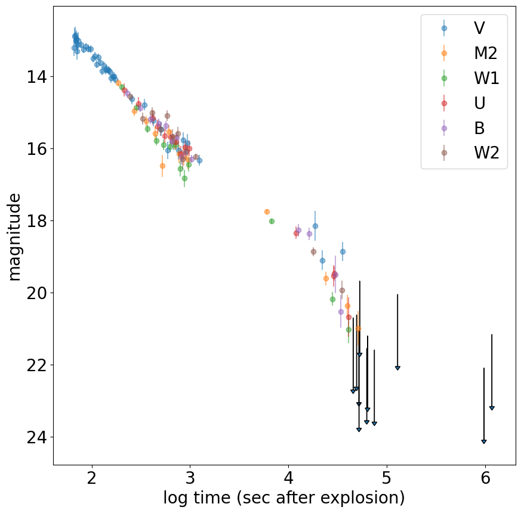
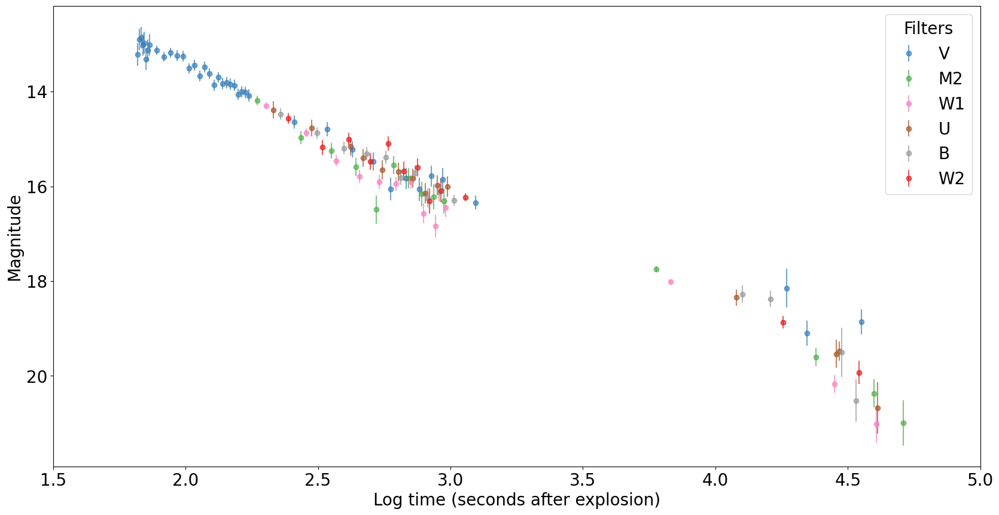

# Before plot

# After plot

This plot is taken from the course, in particular the exercise of plotting GRB afterglows photometric data.
I removed the upper limit arrows as they were not used in the modeling afterwards. I then rescaled the x axis to show the data properly and to diminish clutter.
I changed the marker colours to be more colourblind friendly (https://gist.github.com/thriveth/8560036) and slightly upped the opacity, which makes the data a bit easier to look at (I suspect this might simply be a matter of opinion).
I also added a title to the legend for clarity.
